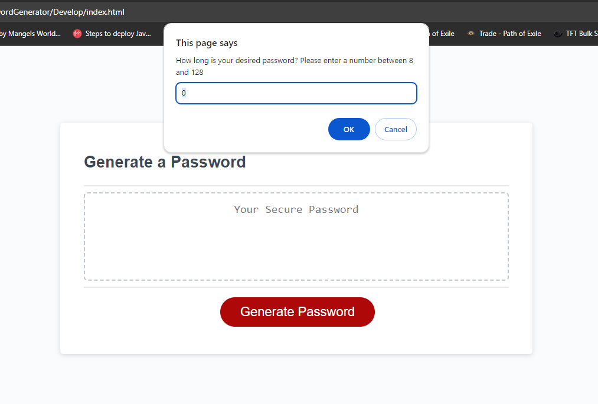

# <Password Generator>

## Description

Provide a short description explaining the what, why, and how of your project. Use the following questions as a guide:

- Making an automated password generator for future use.
- Learning how to use all JS tools thought to us to make a cohesive functional application

## Table of Contents

- [Installation](#installation)
- [Usage](#usage)
- [Credits](#credits)
- [License](#license)

## Installation

No installation necessary, page already live

## Usage

Simply click the generate password button and follow the prompts

## Credits

-Serg Malyshka

## License

Standard MIT licence
